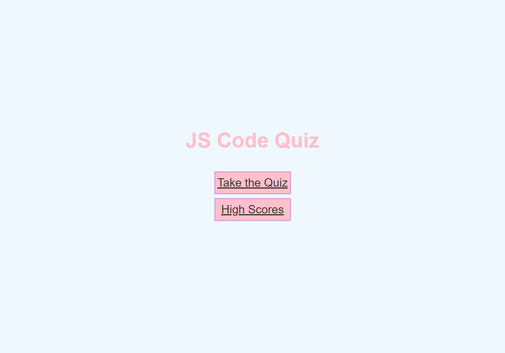
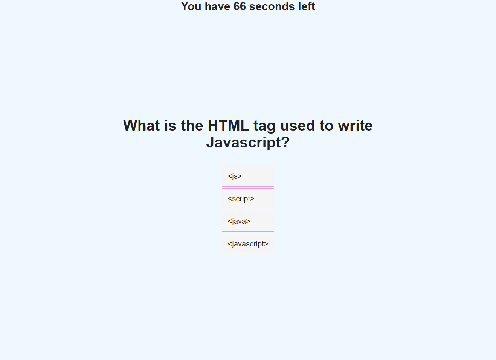
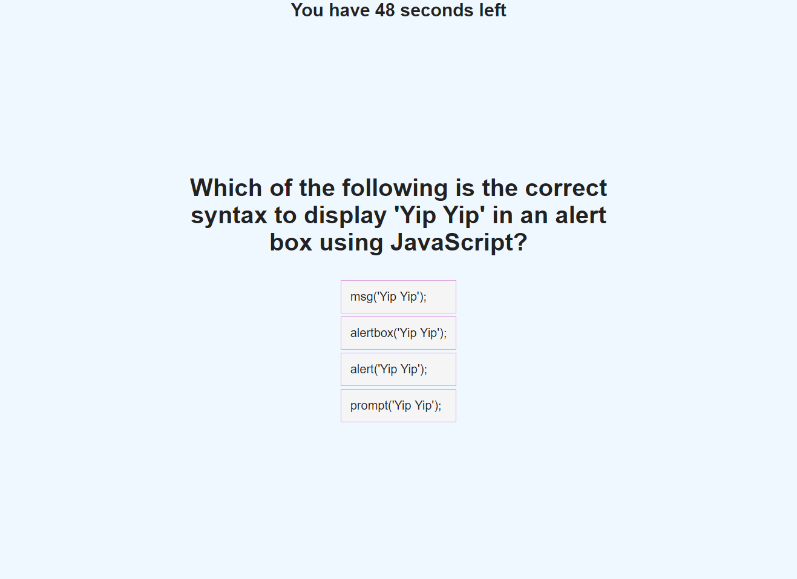
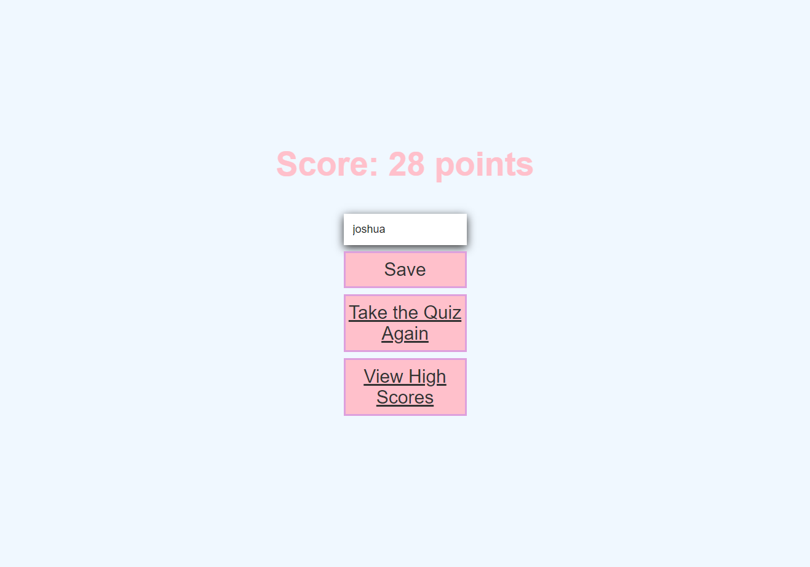
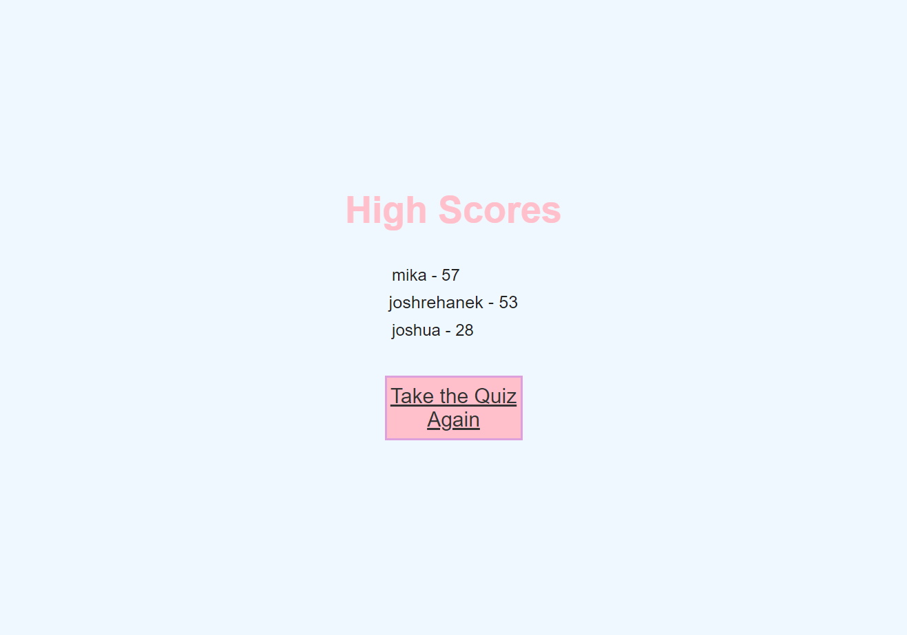

# JS Code Quiz
- This is a multiple choice 5 question timed quiz that tells the user if they got the answer correct then records and stores the users score in local storage.

## Table of contents
- [General Info](#general-info)
- [Link to deployed page](#general-info)
- [Home Page](#home-page)
- [Question 1](#question-1)
- [Question 2](#question-2)
- [End Game Page](#end-game-page)
- [High Scores Page](#high-score-page)
- [Technologies](#technologies)
- [Summary](#summary)
- [Author](#author)

## General Info

This code quiz meets the following criteria:

GIVEN I am taking a code quiz
WHEN I click the start button
THEN a timer starts and I am presented with a question
WHEN I answer a question
THEN I am presented with another question
WHEN I answer a question incorrectly
THEN time is subtracted from the clock
WHEN all questions are answered or the timer reaches 0
THEN the game is over
WHEN the game is over
THEN I can save my initials and score

## Link to deployed page

- https://joshrehanek.github.io/js-code-quiz/

## Home Page

## Question 1

## Question 2

## End Game Page

## High Scores Page

## Technologies

This project is created with:

- [HTML](https://html.com/)
- [CSS](https://www.w3.org/Style/CSS/Overview.en.html)
- [Javascript](https://javascript.com/)

## Summary

- This is a multiple choice 5 question timed quiz that tells the user if they got the answer correct then records and stores the users score in local storage.

## Author

- Joshua Azzam Rehanek